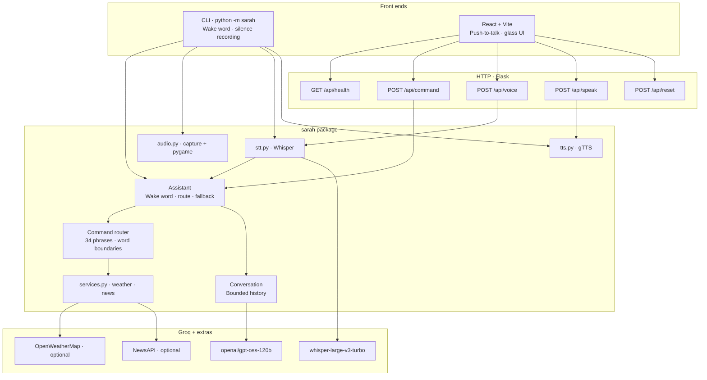
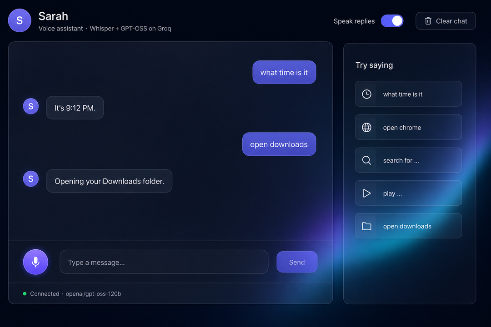
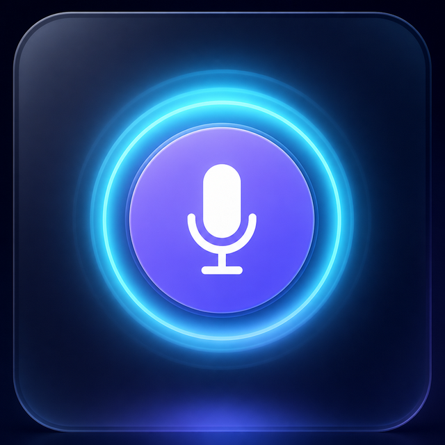
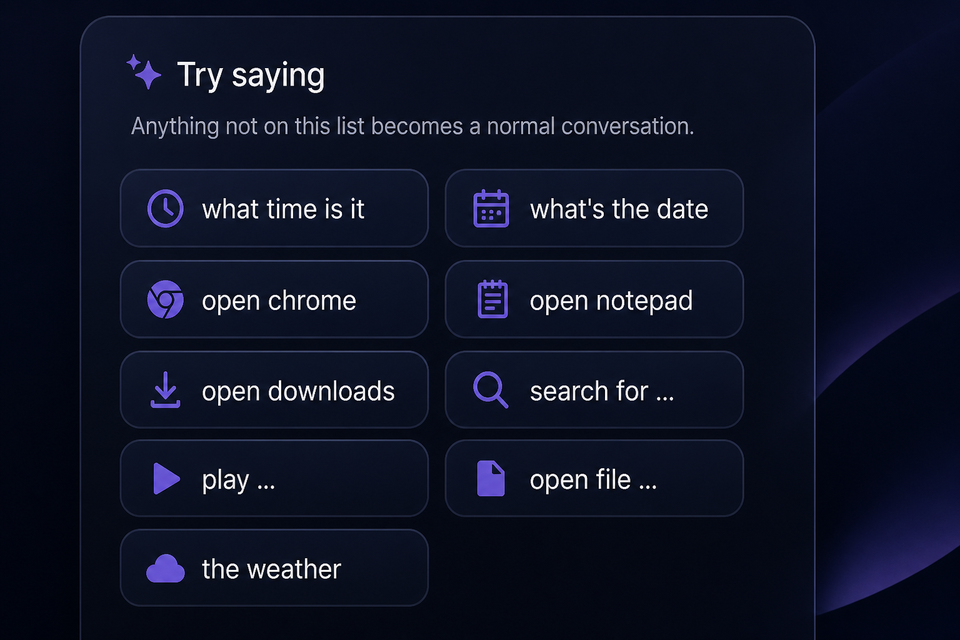
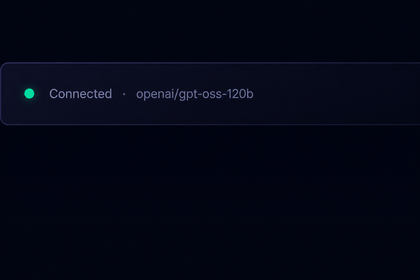
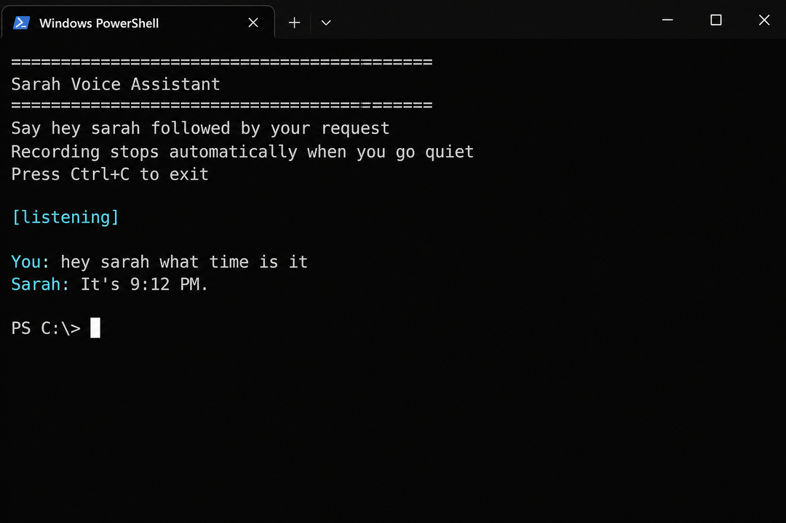
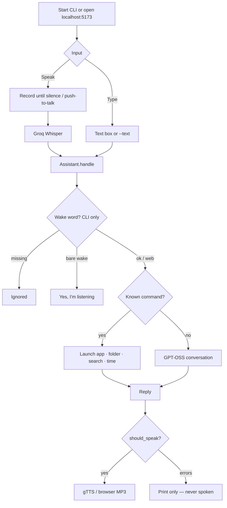

<div align="center">


# Sarah

### AI-Powered Virtual Desktop Assistant

A hands-free desktop assistant that combines **speech-to-text**, **spoken command routing**, **conversational AI**, and a **push-to-talk web client** — built to control a Windows desktop and answer anything that is not a command.

[](https://www.python.org/)
[](https://flask.palletsprojects.com/)
[](https://react.dev/)
[](https://vite.dev/)
[](https://groq.com/)
[](https://gtts.readthedocs.io/)
[](https://www.pygame.org/)
[](https://docs.pytest.org/)
[](LICENSE)

**Theme** · Midnight navy (`#070a16`) · Violet (`#7c6cff`) · Cyan (`#38d8f0`) · Glassmorphism · Premium voice UI

`http://localhost:5173` · API `http://127.0.0.1:5000`

**Built by [Mohammed Rashique Shuraim](https://github.com/MohammedShuraim)**

</div>

---

## Project Overview

**Sarah** is a full-stack voice product that behaves like one assistant — not a pile of scripts taped together.

The same `Assistant` class drives the microphone loop and the browser. Recording, HTTP, and playback stay outside it, so the CLI and the React client cannot drift apart in what they understand.

| Capability | What it does |
|---|---|
| **Wake word** | Stays quiet until she hears *hey Sarah*, so hallway chatter is not a command |
| **Silence-aware recording** | Ends the take when you stop talking — no fixed five-second cutoff |
| **34 spoken commands** | Launch apps, open user folders, Google / YouTube search, open a file by name, time, date, weather, news |
| **Conversational fallback** | Anything unmatched goes to Groq `openai/gpt-oss-120b` with a bounded memory of recent turns |
| **Speech pipeline** | Groq Whisper in · gTTS + pygame out · Python 3.13 safe (no `audioop`) |
| **Terminal voice loop** | `python -m sarah` — wake word, typed mode, command listing, model health check |
| **Web client** | React 19 + Vite 8 push-to-talk UI, live mic level, spoken replies in the browser |
| **Flask API** | Health, commands, text, voice upload, MP3 synthesis, conversation reset |

The product journey is designed as one loop:

**Listen → Transcribe → Route command or chat → Speak the reply → Remember the turn.**

---

## Architecture



**Voice request path (web)**

`MicButton → MediaRecorder (WebM/OGG/M4A) → POST /api/voice → Whisper → Assistant.handle() → command or GPT-OSS → JSON reply → POST /api/speak → browser plays MP3`

**Voice request path (CLI)**

`record_until_silence → Whisper → Assistant.handle(wake word) → command or GPT-OSS → gTTS → pygame.mixer`

The system prompt is stored separately from chat history so it cannot be trimmed away. Failed chat turns are popped so the log never ends on an unanswered user message.

---

## UI Showcase

> Visual language: midnight navy (`#070a16`), violet (`#7c6cff`), cyan (`#38d8f0`), glass cards, aurora wash, Inter typography, live mic ring.

| Surface | Preview |
|---|---|
| **Web chat** |  |
| **Microphone** |  |
| **Command palette** |  |
| **Status bar** |  |
| **CLI voice loop** |  |

> Drop PNG/WebP captures under `docs/screenshots/` using the filenames above so the table lights up on GitHub.

---

## Application Flow



On the web UI the mic button *is* the intent — the wake word is off. After you stop recording:

**Uploading → Transcribing → Routing → Speaking**

---

## Features

### Voice capture

| Feature | Status |
|---|---|
| Fixed-length recording (first revision) | Replaced |
| Silence detection (RMS, 50 ms frames) | Implemented |
| `MAX_RECORD_SECONDS` backstop | Implemented |
| Trailing silence kept for Whisper | Implemented |
| Browser `MediaRecorder` + MIME probe | Implemented |
| Live input-level visualiser | Implemented |
| Auto-stop after 20 s in the browser | Implemented |

### Speech · playback

| Feature | Status |
|---|---|
| Groq Whisper transcription | Implemented |
| In-memory `transcribe_bytes` for WebM | Implemented |
| Actionable `TranscriptionError` (401 / 429) | Implemented |
| gTTS spoken replies | Implemented |
| Windows `mkstemp` temp-file fix | Implemented |
| pygame playback (Python 3.13) | Implemented |
| Browser MP3 via `/api/speak` | Implemented |

### Commands

| Feature | Status |
|---|---|
| Phrase table, not an intent model | Implemented |
| Word-boundary prefix match (`play` ≠ `display`) | Implemented |
| Longest-match wins | Implemented |
| Apps via `cmd start` (Windows) | Implemented |
| Folders from `Path.home()` | Implemented |
| Google / YouTube with `quote_plus` | Implemented |
| Open file by name + common extensions | Implemented |
| Weather / news degrade if keys missing | Implemented |
| English phrases only (Hindi falls through to chat) | Current limit |

### Conversation

| Feature | Status |
|---|---|
| Groq chat client | Implemented |
| Bounded history (`HISTORY_LIMIT=20`) | Implemented |
| 401 / 429 messages a person can act on | Implemented |
| GPT-OSS `reasoning_effort=low` | Implemented |
| Empty-reply guard + token-budget advice | Implemented |
| `--check-models` against live Groq | Implemented |
| Errors shown, never spoken | Implemented |

### Clients

| Feature | Status |
|---|---|
| CLI wake word + `--no-wake-word` | Implemented |
| Typed mode `--text` | Implemented |
| `--list-commands` | Implemented |
| Flask health / command / voice / speak / reset | Implemented |
| React chat, palette, status bar | Implemented |
| Model name read from `/api/health` | Implemented |

---

## Technology Stack

| Layer | Technologies |
|---|---|
| **Core** | Python 3.10–3.13 · `sarah/` package · dataclasses · pytest · ruff |
| **Voice** | sounddevice · numpy · pygame · gTTS · Groq Whisper |
| **AI** | Groq Chat Completions · `openai/gpt-oss-120b` · reasoning-aware client |
| **Commands** | Phrase router · webbrowser · `os.startfile` / `xdg-open` |
| **Optional data** | OpenWeatherMap · NewsAPI |
| **API** | Flask · Flask-CORS · python-dotenv |
| **Frontend** | React 19 · Vite 8 · MediaRecorder · AnalyserNode |
| **Quality** | 46 offline tests · ruff (`E,F,I,UP,B,SIM`) |

---

## Setup Instructions

### Prerequisites

- Python **3.10+** (tested through **3.13**)
- Node.js **20.19+** or **22.12+** *(web UI only)*
- A microphone and speakers *(or use `--text`)*
- A free Groq key from [console.groq.com/keys](https://console.groq.com/keys)

### 1. Clone

```bash
git clone https://github.com/MohammedShuraim/sarah-voice-assistant.git
cd sarah-voice-assistant
```

### 2. Backend / package

```bash
python -m venv .venv
# Windows
.venv\Scripts\activate
# macOS / Linux
# source .venv/bin/activate

pip install -r requirements.txt
copy .env.example .env          # Windows
# cp .env.example .env          # macOS / Linux
# Set GROQ_API_KEY in .env
```

### 3. Voice assistant (CLI)

```bash
python -m sarah
```

Say **“hey Sarah, what time is it”**, pause, and she answers. `Ctrl+C` to quit.

| Flag | Purpose |
|---|---|
| `--no-wake-word` | Reply to every utterance |
| `--text` | Type instead of speaking |
| `--list-commands` | Print every built-in phrase |
| `--check-models` | Confirm Groq still serves your models |

### 4. Web interface

```bash
python server.py                # API · http://127.0.0.1:5000
```

```bash
cd frontend
npm install
npm run dev                     # UI · http://localhost:5173
```

| Service | URL |
|---|---|
| Web UI | http://localhost:5173 |
| Flask API | http://127.0.0.1:5000 |
| Health | http://127.0.0.1:5000/api/health |

Vite proxies `/api` to Flask. The browser only grants the microphone on `localhost` or HTTPS.

### 5. Tests and lint

```bash
pip install -r requirements-dev.txt
pytest
ruff check .
ruff format .
```

The suite patches `webbrowser.open` and `os.startfile`, so it will not launch apps on your desktop.

---

## Project Structure

```text
sarah-voice-assistant/
├── sarah/
│   ├── config.py              # .env loading · model IDs · wake word
│   ├── audio.py               # silence-aware capture · pygame playback
│   ├── stt.py                 # Groq Whisper · file + in-memory
│   ├── tts.py                 # gTTS · Windows-safe temp files · MP3 bytes
│   ├── ai.py                  # Conversation · reasoning params · --check-models
│   ├── commands.py            # 34-phrase router · apps · folders · search
│   ├── services.py            # Weather · news (optional keys)
│   ├── assistant.py           # Wake word → route → chat
│   ├── cli.py                 # Terminal loop · flags
│   └── __main__.py            # python -m sarah
├── server.py                  # Flask API for the web client
├── frontend/
│   ├── src/
│   │   ├── App.jsx            # Chat session · speak toggle
│   │   ├── api.js             # Health · command · voice · speak · reset
│   │   ├── hooks/useRecorder.js
│   │   ├── components/        # MicButton · MessageList · CommandPalette · StatusBar
│   │   └── styles.css         # Dark glass theme
│   └── vite.config.js         # /api → :5000
├── tests/                     # commands · assistant · AI client
├── docs/
│   ├── banner.svg
│   └── screenshots/           # Product captures for this README
├── .env.example
├── requirements.txt
├── requirements-dev.txt
└── README.md
```

---

## Environment Variables

Template: [`.env.example`](.env.example) · real values go in **`.env`** (gitignored).

### Required

| Variable | Description |
|---|---|
| `GROQ_API_KEY` | Free key from [console.groq.com/keys](https://console.groq.com/keys) |

### Models

| Variable | Default | Description |
|---|---|---|
| `CHAT_MODEL` | `openai/gpt-oss-120b` | Groq chat model (env-swappable) |
| `TRANSCRIBE_MODEL` | `whisper-large-v3-turbo` | Groq Whisper model |
| `REASONING_EFFORT` | `low` | `low` / `medium` / `high` for GPT-OSS |
| `MAX_COMPLETION_TOKENS` | `1024` | Shared by reasoning and the spoken reply |
| `TEMPERATURE` | `0.6` | Groq-recommended band for GPT-OSS |

### Voice behaviour

| Variable | Default | Description |
|---|---|---|
| `WAKE_WORD` | `hey sarah` | CLI activation phrase |
| `REQUIRE_WAKE_WORD` | `true` | `false` = always listen |
| `SILENCE_SECONDS` | `1.2` | Quiet time that ends a take |
| `SILENCE_THRESHOLD` | `0.015` | Raise in a noisy room |
| `MAX_RECORD_SECONDS` | `15` | Hard cap |
| `TTS_LANGUAGE` | `en` | gTTS language |

### Optional extras

| Variable | Description |
|---|---|
| `WEATHER_API_KEY` | [OpenWeatherMap](https://openweathermap.org/api) — without it, weather explains how to enable |
| `NEWS_API_KEY` | [NewsAPI](https://newsapi.org) — same degrade-to-speech pattern |
| `DEFAULT_CITY` | Default for “the weather” (`Hyderabad`) |
| `PORT` / `HOST` / `CORS_ORIGINS` | Flask bind and browser origin |

Groq retires models on a rolling schedule. `llama-3.3-70b-versatile` was shut down on **16 August 2026**. IDs are environment variables so a swap is a `.env` edit. Run `python -m sarah --check-models` to confirm what the account can still reach.

> **Never commit real `.env` files.** If a key lands in git, rotate it in the provider console — deleting the file is not enough.

---

## Commands

Anything not listed here becomes a normal conversation.

| You say | Sarah does |
|---|---|
| `open chrome` · `open notepad` · `open spotify` | Launches the app *(Windows)* |
| `open downloads` · `open documents` · `open pictures` | Opens that folder |
| `search for <anything>` | Google in the browser |
| `play <song>` | YouTube results |
| `open file <name>` | Walks Desktop / Documents / Downloads / … |
| `what time is it` · `what's the date` | Spoken clock / calendar |
| `weather in <city>` | Conditions — needs `WEATHER_API_KEY` |
| `tell me the news` | Headlines — needs `NEWS_API_KEY` |

`python -m sarah --list-commands` prints the full phrase table.

> Command matching is **English phrases**. A Hindi line such as “Chrome खोलो” is transcribed as Hindi, misses the table, and falls through to chat. App launch uses `start chrome` — that only works if the executable is on `PATH`. VS Code is not in the table yet.

---

## API Surface

Built for **one local user**. Conversation history lives in process memory.

| Area | Endpoints |
|---|---|
| Ops | `GET /api/health` |
| Commands | `GET /api/commands` |
| Text | `POST /api/command` · `{ "command": "…" }` |
| Voice | `POST /api/voice` · multipart `audio` (filename extension must match the container) |
| Speech | `POST /api/speak` · `{ "text": "…" }` → `audio/mpeg` |
| Session | `POST /api/reset` |

Missing Groq keys surface as **502** with an actionable sentence, not a bare HTTP 500.

---

## Screenshots

Place product captures here for recruiters and reviewers:

```text
docs/screenshots/
├── web-chat.png
├── mic-button.png
├── commands.png
├── status-bar.png
└── cli.png
```

| Screen | File |
|---|---|
| Web chat | `docs/screenshots/web-chat.png` |
| Microphone | `docs/screenshots/mic-button.png` |
| Command palette | `docs/screenshots/commands.png` |
| Status bar | `docs/screenshots/status-bar.png` |
| CLI voice loop | `docs/screenshots/cli.png` |

---

## Troubleshooting

| Symptom | Fix |
|---|---|
| Could not open the microphone | Another app is holding the device — or use `--text` |
| Recording cuts you off | Lower `SILENCE_THRESHOLD` or raise `SILENCE_SECONDS` |
| CLI never answers | She is waiting for *hey Sarah* — or start with `--no-wake-word` |
| `ModuleNotFoundError: sarah` | Run from the project root |
| `audioop` / playsound errors | This tree uses pygame — reinstall from `requirements.txt` |
| Groq 429 | Free-tier rate limit — wait and retry |
| Chrome / an app does not open | Executable not on `PATH`; Hindi phrases do not hit the router |

---

## Future Enhancements

| Idea | Direction |
|---|---|
| **Hindi / Hinglish commands** | Phrase aliases (`chrome kholo`, `Chrome खोलो`) and language-aware Whisper |
| **App resolver** | Look up Chrome / VS Code under Program Files instead of bare `start chrome` |
| **VS Code · more apps** | First-class `open vs code` / `open cursor` entries |
| **Streaming chat** | Token stream in the web UI like a modern assistant |
| **Per-user sessions** | The API is single-process today; split history if it ever leaves localhost |

---

## Author

**Sarah** is designed and built by **[Mohammed Rashique Shuraim](https://github.com/MohammedShuraim)** — a full-stack voice assistant with a real package boundary, a Flask API, and a React client that share one brain.

| | |
|---|---|
| GitHub | [@MohammedShuraim](https://github.com/MohammedShuraim) |
| This repo | [sarah-voice-assistant](https://github.com/MohammedShuraim/sarah-voice-assistant) |
| Related work | [Sentellent AI](https://github.com/MohammedShuraim/sentinel-ai) — Indian stock intelligence |

---

## License

Distributed under the **MIT License**. See [`LICENSE`](LICENSE) for details.

---

<div align="center">

**Sarah** — speak, and the desktop answers.

Midnight navy · Violet · Cyan · Built to feel like one assistant, not three repos.

</div>
