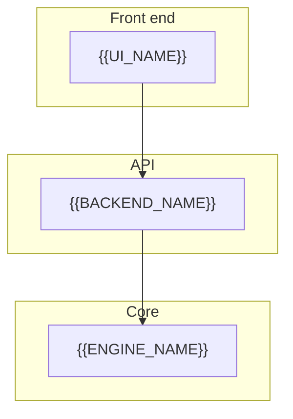

<!--
Copy this into README.md on a new repo and replace every {{PLACEHOLDER}}.
Keep the same section order so your GitHub pages look like one portfolio.
-->

<div align="center">

</div>

---

<div align="center">


<p><b>{{PROJECT_NAME}}</b></p>

<p>{{ONE_LINE_TAGLINE}}</p>

{{TWO_SENTENCE_PITCH}}

<!-- Repeat a shields.io badge per major technology -->
[](https://www.python.org/)
[](LICENSE)

**Theme** · {{COLOR_1}} · {{COLOR_2}} · {{COLOR_3}}

`{{LIVE_OR_LOCAL_URL}}`

**Built by [Mohammed Rashique Shuraim](https://github.com/MohammedShuraim)**

</div>

---

<div align="center">

### See it with your own eyes

▶️ **[Watch the {{PROJECT_NAME}} demo on Loom]({{LOOM_URL}})**

{{DEMO_BEAT_1}} · {{DEMO_BEAT_2}} · {{DEMO_BEAT_3}} · {{DEMO_BEAT_4}}

GitHub cannot play video inside a README — click the preview to watch the walkthrough.

</div>

---

## Project Overview

**{{PROJECT_NAME}}** is {{WHAT_IT_IS}} — not {{WHAT_IT_IS_NOT}}.

| Capability | What it does |
|---|---|
| **{{CAP_1}}** | {{CAP_1_DETAIL}} |
| **{{CAP_2}}** | {{CAP_2_DETAIL}} |
| **{{CAP_3}}** | {{CAP_3_DETAIL}} |

The product journey is designed as one loop:

**{{STEP_1}} → {{STEP_2}} → {{STEP_3}} → {{STEP_4}}**

---

## Architecture



---

## UI Showcase

| Surface | Preview |
|---|---|
| **{{SCREEN_1}}** |  |

---

## Features

| Feature | Status |
|---|---|
| {{FEATURE_1}} | Implemented |
| {{FEATURE_2}} | Implemented |

---

## Technology Stack

| Layer | Technologies |
|---|---|
| **Frontend** | {{FRONTEND_STACK}} |
| **Backend** | {{BACKEND_STACK}} |
| **AI** | {{AI_STACK}} |

---

## Setup Instructions

### 1. Clone

```bash
git clone https://github.com/MohammedShuraim/{{REPO_NAME}}.git
cd {{REPO_NAME}}
```

### 2. Configure

```bash
copy .env.example .env
# set required keys
```

### 3. Run

```bash
{{RUN_COMMAND}}
```

---

## Environment Variables

| Variable | Description |
|---|---|
| `{{REQUIRED_KEY}}` | Required |

> Never commit real `.env` files. Rotate a leaked key in the provider console.

---

## Author

**[{{PROJECT_NAME}}](https://github.com/MohammedShuraim/{{REPO_NAME}})** is designed and built by **[Mohammed Rashique Shuraim](https://github.com/MohammedShuraim)**.

---

## License

Distributed under the **MIT License**. See [`LICENSE`](LICENSE) for details.
